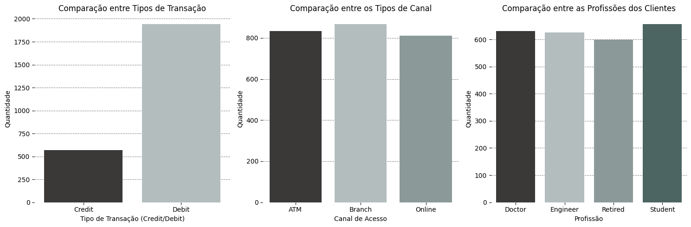
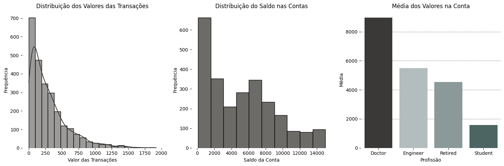
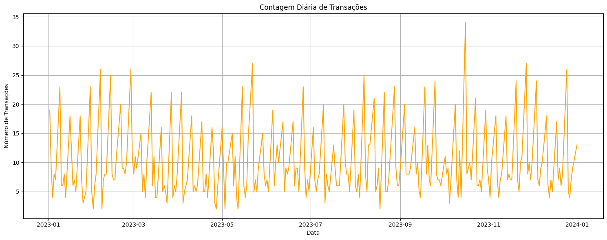
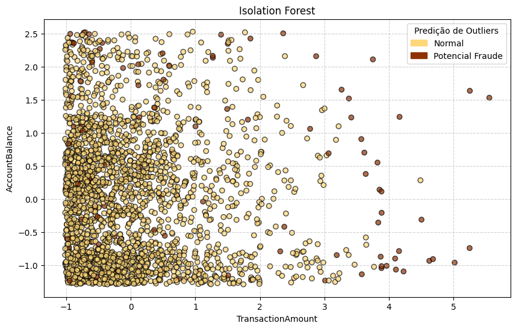

 

# Detecção e Análise de Anomalia

# Introdução
Este trabalho teve como principal linha de raciocínio colocar em prática conhecimento adquirido para construir este estudo de caso sobre detecção de anomalia, tema de fundamental importância na área de ciência de dados.

> [!NOTE]
> O dataset original está disponível no site do **Kaggle** - [🚨 Fraud Detection: Clustering & Anomaly Analysis](https://www.kaggle.com/datasets/valakhorasani/bank-transaction-dataset-for-fraud-detection)

# Objetivo
- **Detecção de Transações Anômalas**: Utilizar algoritmos e técnicas de detecção de anomalias para identificar possíveis transações atípicas.
- **Insights Comportamentais**: Obter insights sobre padrões de comportamento transacional para compreender o comportamento dos clientes e assim identificar possíveis transações atípicas.

# Detalhes do Dataset
Este conjunto de dados oferece uma visão detalhada do comportamento transacional e dos padrões de atividade financeira. Ele contém 2.512 amostras de dados de transações, abrangendo diversos atributos transacionais, dados demográficos de clientes e padrões de utilização. Cada registro fornece insights abrangentes sobre o comportamento das transações.

- **TransactionID**: Identificador alfanumérico único para cada transação.
- **AccountID**: Identificador único para cada conta, com múltiplas transações por conta.
- **TransactionAmount**: Valor monetário de cada transação, variando de pequenas despesas do dia a dia a compras maiores.
- **TransactionDate**: Registro de data e hora de cada transação.
- **TransactionType**: Campo categórico que indica transações de 'Crédito' ou 'Débito'.
- **Location**: Localização geográfica da transação, representada por nomes de cidades dos EUA.
- **DeviceID**: Identificador alfanumérico para dispositivos usados ​​para realizar a transação.
- **IP Address**: Endereço IPv4 associado à transação, com alterações ocasionais para algumas contas.
- **MerchantID**: Identificador único para comerciantes, mostrando os comerciantes preferenciais e os que apresentam discrepâncias em cada conta.
- **AccountBalance**: Saldo da conta após a transação, com correlações lógicas baseadas no tipo e valor da transação.
- **PreviousTransactionDate**: Registro de data e hora da última transação da conta, que auxilia no cálculo da frequência de transações.
- **Channel**: Canal através do qual a transação foi realizada - **Online, ATM (Caixa eletrônico), Branch (Agência Bancária)**.
- **CustomerAge**: Idade do titular da conta, com agrupamentos lógicos baseados na ocupação.
- **CustomerOccupation**: Profissão do titular da conta, **Médico, Engenheiro, Estudante, Aposentado**, refletindo os padrões de renda.
- **TransactionDuration**: Duração da transação em segundos, variando conforme o tipo de transação.
- **LoginAttempts**: Número de tentativas de login antes da transação, sendo que valores mais altos indicam possíveis anomalias.

# Estrutura do Projeto
Primeiro foi realizado uma análise exploratória dos dados, onde foi possível quantificar as variáveis categóricas, como por exemplo:
- tipo de transação (Crédito ou Débito), 
- canal de acesso (Online, ATM ou Branch), 
- profissão dos usuários, 

distribuição dos valores presentes nas contas, além de análise comportamental, onde foi verificado:
- tempo de transação médio por usuário, 
- tentativa de login e a distribuição da idades dos clientes. 

Também foi realizado um estudo sobre a localidade e como os valores estão distribuídos pela região. Para enriquecer mais foi efetuado um estudo do comportamento das transações ao longo do tempo, buscando compreender tendências e sazonalidades do conjunto de dados.

Outra etapa realizado neste projeto foi o de transações consideradas **atípicas**, foi adotado o horário das 9h as 18h e qualquer transação realizada fora deste intervalo, pode ser uma transação anômala.: 
- **Foram identificadas 377 operações an&omalas**.

Por fim, foi usado técnicas de machine learning para identificar transações anômalas, a fim de enriquecer a análise final. Por meio do `Isolation Forest` foi possível **identificar 126 transações anômalas**.

# Insights Relevantes
Todas essas análises foram de extrema importância para entender o padrões e comportamentos dos clientes, entre elas destaco:
- As transações mais frequentes são de **Débito**, quando olhamos os canais de acesso, não existe um tipo predominante;
- Analisando a distribuição dos valores de transação, existe uma **predominância de operações financeiras envolvendo valores baixos**, a presença de **muitos clientes com valores moderados** e **poucos clientes com valores elevados**, e que **Médicos apresentam maior saldo médio em relação as outras profissões**;
- A distribuição da **duração das transações** apresenta uma concentração maior entre **aproximadamente 30 e 180 segundos**, em relação às tentativas de login, a distribuição é fortemente concentrada em apenas uma tentativa;
- Uma análise interessante deste estudo de caso foi que, **de forma geral, os resultados indicam que o tipo de transação exerce maior influência sobre o volume de operações do que a ocupação profissional ou o canal de acesso.**;
- Em relação ao tempo médio de interação com cada canal, destaca-se o grupo de aposentados, que registra o maior tempo médio de atendimento em agências bancárias, neste caso é **recomendado priorizar o atendimento para este perfil para tornar a experiência deste cliente satisfatória**;
- Analisando as cidades **Austin** se destaca das demais por diversos critérios, necessitando de uma atenção especial neste caso;
- Ao estudar o comportamento das transações no decorrer do tempo, vemos que existe um número elevado de operações financeiras realizadas na segunda-feira.